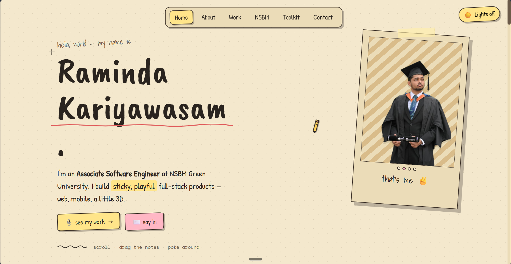
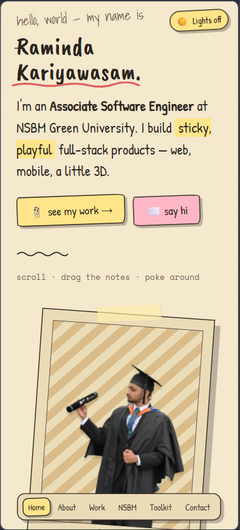

<div align="center">

  <h1>Raminda Kariyawasam — Full-Stack Software Engineer</h1>
  
  <p>
    AI-enabled university platforms, optimization systems, secure enterprise applications, and production infrastructure.
  </p>
  
  <p>
    <a href="#features">Features</a> •
    <a href="#previews">Previews</a> •
    <a href="#tech-stack">Tech Stack</a> •
    <a href="#installation">Installation</a>
  </p>

</div>

---

## 👀 Previews

Here is a look at the portfolio in action, showcasing both the desktop and mobile experiences:

<div align="center">
  
  
</div>

<div align="center">
  <i>Designed to be sticky, playful, and responsive across all devices.</i>
</div>

## ✨ Features

- **Engineering Evidence:** Featured case studies expose architecture lanes, hard problems, security boundaries, and operational considerations.
- **Complete Catalogue:** Multi-category filters cover verified NSBM, AI, Node/TypeScript, Java, PHP, mobile/IoT, client, startup, and personal work.
- **Interactive Sticky Notes:** Drag notes on wide pointer devices or open every project by keyboard without dragging.
- **Playful Cursor & Doodles:** Custom pencil cursor and hand-drawn doodles for a very unique, personalized feel.
- **Light & Dark Themes:** Seamlessly switch between a light parchment "paper" theme and a dark "cork" theme.
- **Accessible Interactions:** Focus-trapped dialogs, Escape close, focus restoration, visible keyboard focus, reduced motion, and mobile stacking.
- **Targeted Résumés:** One chooser provides the immutable original plus Node.js/TypeScript, AI Full Stack, and Java Enterprise versions.
- **React Powered:** Built using React components (`.jsx`) for modular, maintainable, and interactive UI elements.
- **Beautiful Typography:** Hand-drawn web fonts using _Patrick Hand_, _Caveat Brush_, and _Space Mono_.

## 🛠️ Tech Stack

- **Frontend:** HTML5, CSS3, JavaScript (ES6+), React 18
- **Styling:** Custom Vanilla CSS variables for theming
- **Fonts:** Patrick Hand, Caveat Brush, Shadows Into Light, and Space Mono
- **Quality:** Node tests, Playwright, axe-core, PDF validation, and link checks
- **Tooling:** `serve` via npm for local development; deterministic ReportLab résumé generation

## 🚀 Installation & Local Development

This project requires minimal setup. It uses `serve` to render the `index.html` and parse the React files dynamically.

1. **Clone the repository:**

   ```bash
   git clone https://github.com/KADRDulmin/RamindaKariyawasam.git
   cd RamindaKariyawasam
   ```

2. **Install development dependencies:**

   ```bash
   npm install
   ```

3. **Start the local server:**
   ```bash
   npm start
   ```
   _The site will be up and running at [http://localhost:3000](http://localhost:3000) (or whichever port `serve` allocates)._

## 📬 Say Hi

- **Name:** Raminda Kariyawasam
- **Role:** Associate Software Engineer @ NSBM Green University

**Enjoy exploring the site! Scroll, drag the notes, and poke around!** ✌️
